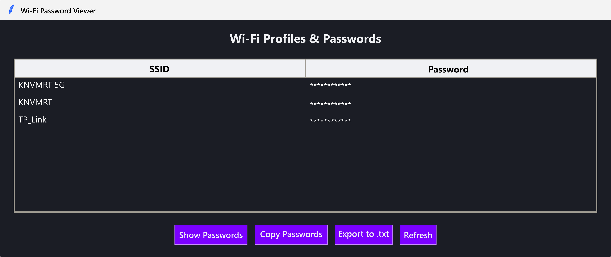

# Wi-Fi Password Viewer (GUI)

This is a simple Python application that shows saved Wi-Fi profiles and their passwords on a Windows system using a clean graphical interface built with Tkinter.

## 🔧 Features
✅ Lists all saved Wi-Fi profiles (SSIDs)
✅ Displays passwords if available
✅ Organized in a table-like layout
✅ Exported as `.exe` for easy use

## Screenshot


## ⚙️ How to Use
1. Run the app (`wifi_password_viewer.py`) using Python **or** run the compiled `.exe` file.
2. Click the **"Show Wi-Fi Passwords"** button.
3. All stored networks and their passwords will appear in the table.
   
## Installation
Ensure you have Python installed (version 3.x recommended).

1. Clone this repository:
   ```bash
   git clone https://github.com/knvmrt/wifi-password-viewer.git
   ```
2. Run the Python script:
   ```bash
   python wifi_password_viewer.py
   ```

## 📦 Build as .exe
To compile this app as an executable:

```bash
pip install pyinstaller

pyinstaller --onefile --windowed --icon=./assets/img/icon.ico wifi_password_viewer.py
```

The .exe file will be created in the dist/ folder.

---

[**_by knvmrt_**](https://github.com/knvmrt)